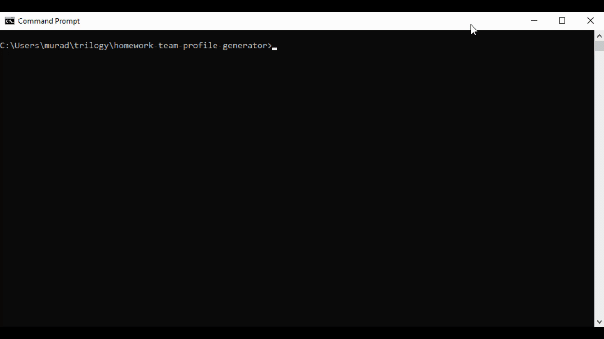

# homework-team-profile-generator

## Description
This project will run on node.js and will ask few questions about the team and then generate a runtime html displaying team information.
    
## Table of Contents
- [Installation](#installation)
- [Usage](#usage)
- [Tests](#tests)
- [Screenshot](#screenshot)
- [WalkthroughVideo](#walkthroughvideo)
- [License](#license)
- [Questions](#questions)

## Installation  

To install type

    npm install

This will install all the dependency modules
      
## Usage      
    npm start

To start the project, type the above command and answer the prompts.

      
## Tests
    npm run test                    -- this will run all the tests

    npm test Employee.test.js       -- this will do the individual test

## Screenshot

## WalkthroughVideo

## License
This project is covered under MIT License. 
            For more information [click here](https://opensource.org/licenses/MIT)
      
## Questions
Feel free to email at murad.manni@gmail.com, if you have any further questions relating to this project.

Checkout more on [Github](https://github.com/muradmanni)
    